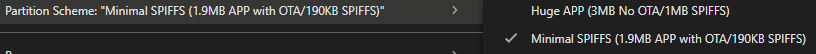

# ESP32-CAM Web Stream + Wi‑Fi Manager + OTA (Esp32camV8)

This project provides a robust and enhanced web interface for the AI‑Thinker ESP32‑CAM with live MJPEG streaming, camera controls, Wi‑Fi network management, SD capture, and OTA firmware updates. Version 8 includes significant improvements in reliability, security, and performance.

## 📋 Table of Contents

- [Features](#-features)
- [Hardware](#-hardware)
- [Project Structure](#-project-structure)
- [Quick Start](#-quick-start)
  - [Install ESP32 Support](#1-install-esp32-support)
  - [Libraries](#2-libraries)
  - [Configure](#3-configure)
  - [Build & Flash](#4-build--flash)
  - [Configure OTA Settings](#5-configure-ota-settings-important)
- [Using the Web Interface](#-using-the-web-interface)
- [Wi‑Fi Behavior](#-wi‑fi-behavior)
- [mDNS](#-mdns)
- [OTA Updates](#-ota-updates)
- [API Reference](#-api-reference)
- [Serial Logs](#-serial-logs)
- [Reset to Defaults Feature](#-reset-to-defaults-feature)
  - [How to Use](#how-to-use)
  - [What Gets Reset](#what-gets-reset)
  - [Benefits](#benefits)
- [Troubleshooting](#-troubleshooting)
- [Security Notes](#-security-notes)
- [Version 8 Improvements](#-version-8-improvements)
  - [Critical Bug Fixes](#critical-bug-fixes)
  - [Performance Enhancements](#performance-enhancements)
  - [Security Improvements](#security-improvements)
  - [System Diagnostics](#system-diagnostics)
- [License](#-license)

## 🚀 Features
- Live MJPEG stream at `/stream` with enhanced error handling
- Photo capture to SD (`/capture`), timestamped filenames with write verification
- Camera settings UI (framesize, brightness, contrast, saturation, white balance, quality, mirror/flip, AGC/AEC2, AE level, AWB gain, effects, sharpness)
- **Reset to Defaults** button for optimal camera settings based on hardware configuration
- Saved Wi‑Fi networks (add/delete), auto‑connect on boot with AP fallback
- OTA update portal at `/update` (HTTP Basic Auth)
- mDNS discovery (`http://esp32camshit.local` by default)
- Enhanced status logging over Serial with emoji prefixes
- Memory monitoring and system diagnostics
- Input validation and security enhancements
- Improved WiFi connection handling with detailed status reporting

## 🔧 Hardware
- Module: AI‑Thinker ESP32‑CAM (OV2640)
- Flash LED: GPIO 4
- SD Card: `SD_MMC` interface
- Board selection in Arduino IDE: `AI Thinker ESP32‑CAM`

## 📁 Project Structure
- `Esp32camV8/Esp32camV8.ino` — main sketch (enhanced version)
- `API.md` — HTTP API reference with V8 improvements
- `CHANGELOG.md` — Version history and updates

## ⚡ Quick Start
### 1. Install ESP32 Support
- Arduino IDE: Boards Manager → install "ESP32 by Espressif Systems".

### 2. Libraries
- `ElegantOTA` (install via Library Manager) — used for OTA portal.
- All other includes are provided by the ESP32 core (`esp_camera`, `WiFi`, `WebServer`, `Preferences`, `SD_MMC`, `ESPmDNS`).

### 3. Configure
- Open `Esp32camV8/Esp32camV8.ino` and update:
  - `MDNS_HOSTNAME` — device hostname (lowercase, default: "esp32camshit")
  - `OTA_USER` and `OTA_PASS` — credentials for OTA portal (change from defaults!)

### 4. Build & Flash
- Board: `AI Thinker ESP32‑CAM`
- Port: your device's COM port
- Flash sketch normally. First boot will attempt Wi‑Fi connections from saved list (empty on first run).

### 5. Configure OTA Settings (Important!)
To enable OTA updates, you must configure the following settings in Arduino IDE:

**Required Arduino IDE Settings:**
- **Tools → Partition Scheme**: `Default 4MB with spiffs (1.2MB APP/1.5MB SPIFFS)`
- **Tools → Flash Size**: `4MB (32Mb)`
- **Tools → PSRAM**: `Enabled` (if your board supports it)
- **Tools → Arduino Runs On**: `Core 1`
- **Tools → Events Run On**: `Core 1`

⚠️ **Critical**: Without these settings, OTA updates will fail or cause boot loops!

## 🌐 Using the Web Interface
- Open `http://<device-ip>/` or `http://<hostname>.local/` (default `http://esp32camshit.local/`).
- Live stream appears under "Live Stream" with enhanced error handling.
- Adjust camera settings and click "Apply & Save" (persists to Preferences with input validation).
- **Reset to Defaults** button restores optimal camera settings based on your hardware configuration.
- "Capture & Save" takes a photo (requires SD card) and saves it to `/` on the SD card with write verification.
- Manage Wi‑Fi networks in "Saved Networks" and "Add Network" with enhanced validation.
- Use "OTA Update" to access the update portal; use your configured credentials.
- Monitor system status through enhanced Serial logging with emoji prefixes.

## 📶 Wi‑Fi Behavior
- Enhanced connection logic with detailed status monitoring and early failure detection
- On boot, the device iterates saved networks and tries to connect (10‑second timeout per network).
- On successful connect:
  - Serial shows SSID, local IP, and signal strength.
  - LED on GPIO 4 blinks 5 times as a success indicator.
  - The connected network's IP is stored with that SSID.
- Connection attempts now include:
  - Detailed status monitoring during connection attempts
  - Early failure detection for invalid credentials or unavailable networks
  - Signal strength reporting on successful connections
  - Improved timeout handling with proper cleanup
- If none connect:
  - Fallback AP mode starts with SSID `ESP32-CAM-Fallback`, password `esp32cam`.
  - LED stays ON while in AP mode.

## 🔍 mDNS
- If mDNS starts successfully, the device registers HTTP service on port 80.
- Access via `http://<MDNS_HOSTNAME>.local/` (defaults to `esp32camshit`).

## 🔄 OTA Updates
- Visit `http://<device>/update`.
- Authenticate with `OTA_USER` / `OTA_PASS` (configured in the sketch).
- Upload the compiled binary; upon success, the device will reboot automatically.

## 📚 API Reference
- See `API.md` for full details and cURL examples for all endpoints.

## 📊 Serial Logs
- Enhanced logging system with detailed status reporting and system diagnostics:
  - 🔄 ongoing actions (e.g., OTA progress, connect attempts)
  - ✅ successes
  - ⚠️ warnings (non‑critical)
  - ❌ critical errors
  - 🌐 network info
  - 📸 camera operations
  - 🗑️ deletions
  - 🌟 status indicators
  - 🚀 startup complete
  - 💾 memory monitoring (every 30 seconds)
- New diagnostic features:
  - PSRAM detection and reporting
  - Memory usage monitoring (heap and PSRAM)
  - Enhanced WiFi connection status with signal strength
  - Camera initialization status reporting
  - SD card mount status reporting

## 🔧 Troubleshooting
- **Camera init failed** (`❌ Camera init failed`):
  - Power the module with a stable 5V/≥1A supply.
  - Ensure the camera ribbon cable is fully seated.
  - Reduce framesize/quality if memory constrained; confirm PSRAM is available.
  - Check Serial logs for specific error codes and PSRAM detection status.

- **SD_MMC mount failed** (`⚠️ SD_MMC Mount Failed`):
  - Use a formatted microSD (FAT/FAT32), insert firmly before boot.
  - Try a different card; some cards are unreliable on ESP32‑CAM.
  - Enhanced error reporting now shows specific failure reasons.

- **No Wi‑Fi connection**:
  - Add a network via the web UI (AP mode SSID `ESP32-CAM-Fallback`, pass `esp32cam`).
  - Verify credentials and signal strength; relocate closer to the router.
  - Enhanced connection logs now show detailed status and failure reasons.

- **Stream stutters or disconnections**:
  - Improved client disconnection detection and frame buffer management.
  - Lower framesize or increase JPEG quality value (worse compression) to reduce CPU.
  - Close extra browser tabs/clients; multiple viewers increase load.
  - Check Serial logs for streaming error messages.

- **Capture doesn't save**:
  - Requires SD card mounted. Enhanced error reporting shows specific failure reasons.
  - Check Serial logs for detailed write verification results.
  - New validation ensures complete file writes before reporting success.

- **Memory issues**:
  - Monitor memory usage through Serial logs (reported every 30 seconds).
  - PSRAM detection status is reported at startup.
  - Consider reducing frame size or quality if memory is constrained.

- **OTA update failures**:
  - Ensure Arduino IDE settings are configured correctly (see [Configure OTA Settings](#5-configure-ota-settings-important))
  - Check that partition scheme is set to `Default 4MB with spiffs`
  - Verify flash size is set to `4MB (32Mb)`
  - Ensure both cores are set to `Core 1`
  - Check Serial logs for OTA error messages

## 🔒 Security Notes
- Change `OTA_USER` and `OTA_PASS` before deploying (defaults are insecure!).
- Enhanced input validation and bounds checking on all API endpoints.
- WiFi credential validation with length limits (SSID: 32 chars max, Password: 63 chars max).
- Camera parameter validation with automatic bounds checking.
- Keep the device on a trusted network. API is intentionally simple and unauthenticated (except OTA) for ease of use.

## Version 8 Improvements

### Critical Bug Fixes
- **Fixed memory leaks** in streaming function with proper client disconnection handling
- **Fixed buffer overflow** potential in network credential parsing with bounds checking
- **Fixed race condition** in camera settings loading (now loads after camera initialization)
- **Enhanced SD card error handling** with write verification and detailed error reporting
- **Improved WiFi connection handling** with proper status monitoring and early failure detection

### Performance Enhancements
- **Optimized memory usage** with PSRAM detection and dual frame buffer support
- **Enhanced streaming performance** with better client connection monitoring
- **Added memory monitoring** with periodic heap/PSRAM reporting every 30 seconds
- **Improved camera initialization** with detailed status reporting and error handling

### Security Improvements
- **Input validation** on all API endpoints with automatic bounds checking
- **WiFi credential validation** with proper length limits and duplicate checking
- **Camera parameter sanitization** using constrain() functions for all inputs
- **Enhanced error handling** with specific error codes and detailed reporting

### System Diagnostics
- **Enhanced logging** with detailed startup sequence and status reporting
- **Memory monitoring** with heap and PSRAM usage tracking
- **WiFi status reporting** with signal strength and connection quality
- **Camera diagnostics** with PSRAM detection and initialization status
- **SD card monitoring** with mount status and operation verification

## Reset to Defaults Feature

The new "Reset to Defaults" button provides an easy way to restore optimal camera settings:

### How to Use
1. Open the web interface and navigate to the "Camera Settings" section
2. Click the "Reset to Defaults" button (orange button next to "Apply & Save")
3. Confirm the reset in the dialog box
4. The page will reload with optimal settings applied

### What Gets Reset
- **Frame Size**: VGA (640x480) - optimal balance of quality and performance
- **JPEG Quality**: Automatically selected based on your ESP32-CAM's memory:
  - Quality 10 (high quality) if PSRAM is detected
  - Quality 12 (good quality) if no PSRAM available
- **Image Settings**: All reset to neutral values (brightness: 0, contrast: 0, saturation: 0, sharpness: 0)
- **Auto Controls**: Auto white balance, auto gain control, and AWB gain enabled
- **Gain Ceiling**: 2X (optimal for most lighting conditions)
- **Effects**: None (clean, natural image)
- **Mirror/Flip**: Both disabled

### Benefits
- **One-click optimization**: No need to manually adjust multiple settings
- **Hardware-aware**: Automatically selects best quality for your specific ESP32-CAM
- **Improved streaming**: Better performance and image quality
- **Troubleshooting**: Quick way to reset if camera settings get misconfigured

License
- Provided as‑is for personal/educational use. Adapt as needed for your project.

